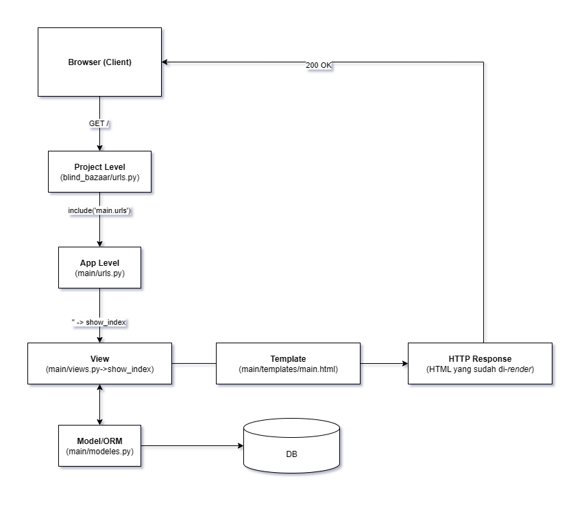

# Blind Bazaar
Tugas Individu 2 PBP oleh Adam Rayyan Aryasatya (NPM 2406496031)

## Link Deployment PWS
http://adam-rayyan-blindbazaar.pbp.cs.ui.ac.id/

## Contents
- [Tugas 2](#tugas-2)
- [Tugas 3](#tugas-3)
- [Tugas 4](#tugas-4)


## Tugas 2

### Step-by-step *Checklist* Implementasi
#### Membuat sebuah proyek Django baru.

-   Membuat *virtual environment* Python dengan perintah `python -m venv env`, dan mengaktifkannya dengan perintah `env\Scripts\activate`.
-   Membuat file `requirements.txt` yang berisi *dependencies* untuk menjalankan appnya (*copy-paste* list dependencies pada Tutorial 0).
-   Buat project Django baru dengan perintah `django-admin start project blind_bazaar .`.

#### Membuat aplikasi dengan nama *main* pada proyek tersebut.

-   Jalankan perintah `python manage.py startapp main`.
-   Jangan lupa tambahkan `'main'` ke `INSTALLED_APPS` pada `blind_bazaar/settings.py`.
    ```py
    INSTALLED_APPS = [
        # other stuff
        'main',
    ]
    ```
#### Melakukan *routing* pada proyek agar dapat menjalankan aplikasi `main`.
-   Tambahkan *modules-modules* di bawah ini pada `blind_bazaar/urls.py`
    ```py
    from django.urls import path, include
    ```
-   Tambahkan URL app `main`
    ```py
    path('', include('main.urls'))
    ```
    Baris ini akan mengarahkan request untuk `http://<url>/` ke `main`.


#### Membuat model pada aplikasi `main` dengan nama `Product` dan memiliki atribut wajib sebagai berikut.

-   Buat model baru dengan nama `Product` pada `main/models.py` dan tambahkan atribut yang sesuai
    ```py
    import uuid
    from django.db import models

    class Product(models.Model):
        CATEGORY_CHOICES = [
            # truncated
        ]

        RARITY_CHOICES = [
            # truncated
        ]

        id = models.UUIDField(primary_key=True, default=uuid.uuid4, editable=False)
        name = models.CharField(max_length=255, unique=True)
        # ... tambahkan atribut-atribut lainnya

        def __str__(self):
            return f"{self.name} ({self.rarity} {self.category})"
    ```

#### Membuat sebuah fungsi pada `views.py` untuk dikembalikan ke dalam sebuah *template* HTML yang menampilkan nama aplikasi serta nama dan kelas kamu.

-   Buat fungsi `show_index` pada `main/views.py` yang menerima `request` sebagai parameter.
-   Pada fungsi tersebut buatlah sebuah dictionary yang berisi value yang ingin disubstitusi ke dalam *template* `main.html` (contohnya seperti `{{ name }}` maka buat dictionary entry dengan key `name`)
    ```py
    from django.shortcuts import render

    def show_index(request):
        context = {
            'npm': '2406496031',
            'name': 'Adam Rayyan Aryasatya',
            'class': 'PBP A',
        }
        return render(request, 'main.html', context)
    ```

#### Membuat sebuah routing pada `urls.py` aplikasi main untuk memetakan fungsi yang telah dibuat pada `views.py`.

-   Buat file `main/urls.py` dan tambahkan baris-baris di bawah ini:
    ```py
    from django.urls import path
    from .views import show_index

    urlpatterns = [
        path('', show_index, name='index'),
    ]
    ```
    Baris-baris tersebut berfungsi untuk memetakan path `''` kepada `show_index` yang akan menampilkan `main.html`.
-   Tambahkan URL app `main` pada `blind_bazaar/urls.py`
    ```py
    from django.contrib import admin
    from django.urls import path, include

    urlpatterns = [
        path('admin/', admin.site.urls),
        path('', include('main.urls')),
    ]
    ```
    Hasilnya semua request kepada *site root* (`/`) akan didelegasikan kepada *URL patterns* yang ada di `main/urls.py`.


#### Melakukan *deployment* ke PWS terhadap aplikasi yang sudah dibuat sehingga nantinya dapat diakses oleh teman-temanmu melalui Internet.

-   Pada website PWS, buatlah sebuah project (jangan lupa simpan kredensial).
-   Konfigurasi *environment variables* yang ada di `.env.prod`.
-   Push branch `master` kepada *remote repository* PWS.
-   Sekarang website bisa diakses pada http://adam-rayyan-blindbazaar.pbp.cs.ui.ac.id/.


### Bagan Request Client




### Peran `settings.py` dalam proyek Django
File settings.py adalah pusat konfigurasi untuk proyek Django. Semua pengaturan utama proyek disimpan di sini agar framework tahu bagaimana aplikasi dijalankan. 

- `INSTALLED_APPS`: daftar aplikasi yang diaktifkan (termasuk `main`).
- `DATABASES`: konfigurasi database (SQLite dev / PostgreSQL prod).
- `TEMPLATES`: loader template (APP_DIRS, DIRS, context processors).
- `STATIC_URL` (+ `STATICFILES_DIRS`/`STATIC_ROOT` saat deploy): file statis.
- `MIDDLEWARE`: middleware per-request.
- `ALLOWED_HOSTS`, `DEBUG`, `SECRET_KEY`: keamanan & mode pengembangan.
- `ROOT_URLCONF`, `WSGI_APPLICATION`/`ASGI_APPLICATION`: entry routing & server.

### Cara kerja migrasi database di Django

Setiap kali ada perubahan pada `models.py`, perlu adanya proses migrasi. Migrasi di Django merupkaan mekanisme untuk menjaga sinkronisasi antara model Python dengan struktur tabel di database. Alur migrasi pada Django seperti berikut:
-   Melakukan beberapa pengubahan model di  `models.py`.
-   Membuat migrasi dengan perintah `python manage.py makemigrations`. Django akan menganalisis perubahan model dan membuat file migrasi yang berisi instruksi untuk mengubah database.
-   Menerapkan migrasi dengan perintah `python manage.py migrate`. Django menjalankan instruksi migrasi tadi untuk membuat/mengubah tabel, kolom, constraint, dsb.


### Alasan framework Django bagus untuk dijadikan permulaan pembelajaran 

Django sering dijadikan permulaan pembelajaran pengembangan perangkat lunak karena sifatnya yang lengkap dan terstruktur. Django sudah menyediakan banyak fitur bawaan seperti autentikasi, ORM, hingga admin panel sehingga pemula tidak perlu repot membangun semuanya dari awal. Selain itu, Django menerapkan prinsip pengembangan perangkat lunak modern seperti "*Don’t Repeat Yourself*" dan yang melatih pemula untuk menulis kode dengan rapi dan konsisten. Dengan kombinasi fitur bawaan yang kuat, struktur proyek yang jelas, dan *best practices* yang diajarkan sejak awal, Django menjadi pilihan ideal sebagai framework pertama untuk memahami pengembangan perangkat lunak dari awal.


### Feedback Tutorial 1

Sejauh ini belum ada, tutorial 0 dan 1 berjalan dengan baik.

## Tugas 3
### Step-by-step *Checklist* Implementasi

#### Adjustments

-   Mengupdate struktur directory dengan mengadakan base template `base.html` pada `templates/base.html`.
-   Mengganti nama kategori pada `main/models.py`.
-   Melakukan beberapa *fine-tuning* terhadap static file CSS.

#### Tambahkan 4 fungsi `views` baru untuk melihat objek yang sudah ditambahkan dalam format XML, JSON, XML by ID, dan JSON by ID.

-   Buka `main/views.py` dan import `serializers` dari `django.core`.
-   Tambahkan fungsi `show_xml(request)`. Fungsi ini akan mengambil semua objek `Product` dengan menggunakan `Product.objects.all()` dan mereturn sebuah `HttpResonse` dengan `serializers.serialize('xml', data)` dan content type yang sesuai dengan xml. Serializers di Django adalah library bawaan yang dapat mengubah (*serialize*) objek model Django ke format lain, seperti JSON, XML, atau YAML.
    ```py
    def show_xml(request):
        data = Product.objects.all()
        return HttpResponse(serializers.serialize('xml', data), content_type='application/xml')

    ```
- Tambahkan juga fungsi `show_json(request)` dengan hal serupa seperti fungsi `show_xml(request)` tetapi dengan JSON.
- Pastikan setiap fungsi mengembalikan response yang valid: `return HttpResponse(..., content_type='...')`.

#### Membuat routing URL untuk masing-masing `views` yang telah ditambahkan pada poin 1.
Detail langkah ini mirip dengan yang sudah kita bahas di Tugas 2.
-   Import fungsi-fungsi baru dari `main/views.py` kepada `main/urls.py` dengan  baris `import main.views as views`.
-   Tambahkan path untuk masing-masing view,
    ```py
    path('products/add/', views.create_product, name='product_add'),
    path('products/<uuid:id>/', views.show_product_detail, name='product_detail'),
    path('xml/', views.show_xml, name='show_xml'),
    path('json/', views.show_json, name='show_json'),
    path('xml/<uuid:id>/', views.show_xml_by_id, name='show_xml_by_id'),
    path('json/<uuid:id>/', views.show_json_by_id, name='show_json_by_id'),
    ```
#### Membuat halaman yang menampilkan data objek model 
-   Pada `main/views.py`, tambahkan list dari semua `Product` dan masukkan ke context 
    ```py
    def show_index(request):
        products = Product.objects.all().order_by('name')
        context = {
            # truncated
            'products': products,
            'product_count': products.count(),
        }
    return render(request, 'main.html', context)
    ```

-   Buatlah template HTML baru `main/templates/product_detail.html` yang:
    -   Melakukan loop atas `products`.
    -   Menampilkan informasi tentang product (name, price, dst.).
    -   Menyediakan tombol "Detail" yang memanggil ``.
    -    Menampilkan tombol "Add Product" di bawah yang memanggil ``.

#### Membuat halaman `form` untuk menambahkan objek model pada app sebelumnya.
-   Buatlah file baru `main/forms.py` dan import module `forms` dari `django`, serta class model `Product`.
-   Tambahkan class form baru dengan nama `ProductForm`. Pada class tersebut, tambahkan class `Meta` yang berisi metadata berupa model dan attribute yang dimiliki modelnya.
    ```py
    class ProductForm(forms.ModelForm):
        class Meta:
            model = Product
            fields = [
                'name',
                'price',
                'description',
                'category',
                'rarity',
                'thumbnail',
                'is_featured',
            ]
    ```
-   Buatlah file template HTML baru pada `main/templates/product_form.html`,
    -   Form menggunakan CSRF token untuk melindungi dari terjadinya CSRF attack dengan menambahkan baris `` pada form element.
    -   Loop setiap field untuk menampilkan label, input, dst.
    -   Tambahkan tombol submit.
-   Pastikan URL deployment ada pada list `CSRF_TRUSTED_ORIGINS` pada `settings.py`.


####  Membuat halaman yang menampilkan detail dari setiap data objek model.
-   Buatlah fungsi baru pada `main/views.py` dengan nama `show_product_detail` yang bertujuan untuk menyajikan detail dari suatu product ketika menekan tombol `Detail`.
-   Ambil produk dengan `get_object_or_404` agar web mengembalikan 404 Not Found jika detail produk yang ingin diakses tidak ada.
-   Buatlah file template HTML baru pada `templates/product_detail.html` yang menampilkan:
    - Informasi tentang produk seperti nama produk, deskripsi, harga, dst.
    - Suatu tombol yang berfungsi untuk kembali ke halaman utama.
-   Pastikan view detail sudah ada di `main/urls.py` (`path('product/<uuid:id>/', views.show_product_detail, name='product_detail')`).

### Mengapa data delivery dibutuhkan dalam pengembangan platform?
Platform modern jarang berdiri sendiri, mereka perlu bertukar data dengan client web, mobile, atau pipeline internal. Data delivery adalah proses untuk mengemas data dari server agar bisa diakses dan dimanfaatkan oleh sistem lain dengan cara yang konsisten, aman, dan mudah dikelola. Tanpa mekanisme ini, data bisa tidak ke*sync*,atau bahkan membahayakan jika sampai bocor. Selain sebagai jembatan komunikasi antar sistem, data delivery juga mempermudah caching, analitik, replikasi data antar layanan, hingga otomatisasi proses bisnis yang saling terhubung.

### Mana yang lebih baik: XML atau JSON? Mengapa JSON lebih populer?
Tidak ada yang "lebih baik" karena penggunaan XML dan JSON tergantung kebutuhan. 
XML cocok digunakan ketika data yang dibagikan sangat kompleks, mengandung atribut, namespace.
Sementara itu, JSON lebih cocok untuk kebutuhan modern karena formatnya sederhana dan sangat dekat dengan cara struktur data bekerja di banyak bahasa pemrograman saat ini. JSON mudah dibaca oleh manusia, ringkas, dan langsung bisa di-parse sebagai objek native seperti dict atau list di Python. JSON juga lebih ringan saat dikirim lewat jaringan internet, sehingga jadi pilihan utama seperti dalam pengembangan aplikasi web yang banyak memakai JavaScript. Inilah alasan kenapa JSON secara praktis lebih sering digunakan di ekosistem pengembangan aplikasi modern.


### Fungsi `is_valid()` pada Django Form dan mengapa diperlukan?
Di Django, setiap kali kita menggunakan form untuk menerima input dari pengguna, kita perlu memastikan bahwa data yang dikirim benar-benar sesuai aturan. Di sinilah peran method `is_valid()`. Ketika method ini dipanggil, Django akan melakukan validasi secara menyeluruh terhadap data yang masuk. Proses ini mencakup pengecekan tipe data, format isian, serta pemanggilan fungsi `clean()` jika ada aturan tambahan dari developer. Jika validasi berhasil, Django akan membuat atribut cleaned_data yang bisa digunakan untuk menyimpan ke database atau memproses data lebih lanjut. Tapi kalau data tidak valid, maka akan muncul informasi error yang bisa langsung ditampilkan ke pengguna. Tanpa `is_valid()`, data dari form tidak boleh digunakan karena belum dicek, dan bisa sangat berisiko.


### Mengapa membutuhkan `csrf_token` di Django? Apa risikonya jika dihilangkan?
Token CSRF di Django berfungsi sebagai pelindung terhadap `Cross-Site Request Forgery`. Serangan ini terjadi ketika pengguna yang sudah login ke suatu website dipancing untuk mengirimkan request yang tidak mereka sadari—misalnya klik link atau buka halaman palsu yang secara diam-diam mengirim form. 

Untuk mencegah ini, Django menyisipkan token unik CSRF token di setiap form yang melakukan request POST. Token ini juga disimpan di *server side* (biasanya lewat cookie), dan Django akan memverifikasi apakah token yang dikirim dari form sama dengan yang disimpan. Kalau tidak, maka request akan diblokir. Jika kita tidak menambahkan `` dalam form HTML, maka Django tidak melakukan pengecekan ini, dan aplikasi jadi rentan terhadap CSRF. Karena itu, menyertakan CSRF token bukan hanya best practice, tapi bagian penting dari keamanan aplikasi.

### Apakah ada feedback untuk asdos di tutorial 2 yang sudah kalian kerjakan?
Belum ada

### Screenshot Postman
https://drive.google.com/drive/folders/103hKEcRFJy_h8G-MBgF1KHQxDTFGBtBt?usp=sharing

## Tugas 4
### Step-by-step *Checklist* Implementasi

#### Mengimplementasikan fungsi registrasi, login, dan logout untuk memungkinkan pengguna mengakses aplikasi sebelumnya sesuai dengan status login/logoutnya
-   Jangan lupa untuk meng-import hal-hal berikut:
    ```py
    import datetime
    from django.http import HttpResponse, HttpResponseRedirect
    from django.urls import reverse
    ```
-   Implementasikan fungsi `register`, `login_user` dan `logout_user` pada `main/views.py`
    ```py
    def register(request):
    form = UserCreationForm()

    if request.method == 'POST':
        form = UserCreationForm(request.POST)
        if form.is_valid():
            form.save()
            messages.success(request, 'Account successfully created!')
            return redirect('main:login')
    context = {'form': form}
    return render(request, 'register.html', context)

    def login_user(request):
        if request.method == 'POST':
            form = AuthenticationForm(data=request.POST)

            if form.is_valid():
                user = form.get_user()
                login(request, user)
                response = HttpResponseRedirect(reverse('main:index'))
                return response
        else:
            form = AuthenticationForm(request)
        context = {'form': form}
        return render(request, 'login.html', context)

    def logout_user(request):
        logout(request)
        response = HttpResponseRedirect(reverse('main:login'))
        return response
    ```

-   Import decorator `login_requeired` dari `django.contrib.auth.decorators`
    ```py
    from django.contrib.auth.decorators import login_required
    ```

-   Pada setiap fungsi yang memerlukan login seperti `show_index` dan `create_product` tambahkan decorator `@login_required(login_url='/login')` pada parameter `login_url` letakkan reverse lookup untuk views login.

-   Decorator `login_required` memastikan user untuk login terlebih dahulu untuk setiap fungsi-fungsi views tersebut.

-   Jangan lupa untuk menambahkan template untuk login dan register.

#### Menghubungkan model Product dengan User.

-   Pada `main/models.py`, import class `User` dari `django.contrib.auth.models`
    ```py
    from django.contrib.auth.models import User
    ```
-   Pada model `Product`, tambahkan baris berikut ini:
    ```py
    user = models.ForeignKey(User, on_delete=models.CASCADE, null=True)
    ```
    Baris tersebut akan menghubungkan `User` dan `Product` melalui relationship sehingga setiap `Product` memiliki `User` yang terasosiasi dengannya.

-   Buat file migrasi dengan `python manage.py makemigrations` dan lakukan migrasi dengan `python manage.py migrate`

-   Pada `main/views.py`, ubah fungsi `create_product` menjadi seperti ini:
    ```py
    @login_required(login_url='/login')
    def create_product(request):
        form = ProductForm(request.POST or None)
        if form.is_valid():
            product_entry = form.save(commit=False)
            product_entry.user = request.user
            product_entry.save()
            return redirect('main:product_detail', product_entry.id)
        
        context = {'form': form}
        return render(request, 'product_form.html', context)
    ```
    Parameter `commit=False` digunakan agar Django tidak langsung menyimpan objek hasil form ke database, sehingga kita mempunyai kesempatan untuk menggantinya sebelum disimpan.

### Menampilkan detail informasi pengguna yang sedang logged in seperti username dan menerapkan cookies seperti last_login pada halaman utama aplikasi.
-   Pada `main/views.py`, ubah fungsi `login_user` dengan menambahkan baris berikut ini:
    ```py
    response.set_cookie('last_login', str(datetime.datetime.now()))
    ```
    Baris tersebut akan menambahkan cookie dengan field `last_login` dan value waktu login.
-   Ubah fungsi `logout_user` dengan menambahkan baris berikut ini:
    ```py
    response.delete_cookie('last_login')
    ```
    Baris tersebut ditambahkan agar ketika kita logout, value pada `last_login` akan dihapus.
-   Ubah fungsi `show_index` menjadi seperti ini:
    ```py
    @login_required(login_url='/login')
    def show_index(request):
        filter_type = request.GET.get("filter", "all")  

        if filter_type == "all":
            products = Product.objects.all()
        else:
            products = Product.objects.filter(user=request.user)
            
        context = {
            'npm': '2406496031',
            'name': request.user.username,
            'class': 'PBP A',
            'products': products,
            'product_count': products.count(),
            'last_login': request.COOKIES.get('last_login', 'Never')
        }
        return render(request, 'main.html', context)
    ```
    
-   Tambahkan juga informasi tentang sesi terakhir login di `main/templates/main.html`:
    ```html
    <div class="pill">
        <span> Last login session: {{ last_login }}</span>
    </div>
    ```

### Apa itu Django `AuthenticationForm`? Jelaskan juga kelebihan dan kekurangannya.

`AuthenticationForm` di Django adalah form bawaan dari `django.contrib.auth.forms` yang digunakan untuk menangani proses login pengguna. Form ini otomatis menyediakan field `username` dan `password`, serta validasi yang terintegrasi dengan sistem otentikasi Django, sehingga memudahkan implementasi login tanpa harus membuat form dari nol.


### Apa perbedaan antara autentikasi dan otorisasi? Bagaiamana Django mengimplementasikan kedua konsep tersebut?

Autentikasi adalah proses untuk memverifikasi identitas pengguna (misalnya login dengan username dan password), sedangkan otorisasi adalah proses untuk menentukan hak akses pengguna terhadap hal-hal tertentu setelah berhasil diautentikasi. Di Django, autentikasi diimplementasikan melalui sistem django.contrib.auth, yang menyediakan model `User` dan `AuthenticationForm` untuk mengecek status login. Sementara itu, otorisasi diatur melalui permission dan group yang bisa dikaitkan dengan objek User, serta decorator `@login_required `yang mengontrol akses berdasarkan status dan hak pengguna.

### Apa saja kelebihan dan kekurangan session dan cookies dalam konteks menyimpan state di aplikasi web?

Session dan cookie sama-sama digunakan untuk menyimpan state di aplikasi web, tetapi memiliki kelebihan dan kekurangan masing-masing. Cookie disimpan di sisi *client* (browser), sehingga ringan bagi server dan mudah digunakan untuk data sederhana seperti preferensi tampilan, tetapi rentan dimanipulasi atau dicuri. Sementara itu, session disimpan di sisi server dan hanya mengandalkan cookie sebagai penampung ID sesi, sehingga lebih aman untuk data sensitif seperti status login atau keranjang belanja. 

### Apakah penggunaan cookies aman secara default dalam pengembangan web, atau apakah ada risiko potensial yang harus diwaspadai? Bagaimana Django menangani hal tersebut?

Secara default, cookies tidak `HttpOnly` yang berarti mereka rentan terhadap pencurian misal melalui attack XSS ataupun CSRF (tanpa `SameSite`/token).
Django mengatasinya dengan session server‑side (cookie hanya berisi sessionid acak), `SESSION_COOKIE_HTTPONLY=True` dan `SESSION_COOKIE_SAMESITE='Lax'` secara default, opsi `Secure` untuk hanya terkirim lewat HTTPS, rotasi session key saat login untuk mencegah fixation, serta middleware CSRF dengan token per‑request. 


## Tugas 5
### Step-by-step *Checklist* Implementasi

#### Implementasikan fungsi untuk menghapus dan mengedit product.
-   Tambahkan kedua fungsi berikut ini, satu untuk menghapus dan satu untuk mengedit
    ```py
    @login_required(login_url='/login')
    def delete_product(request, id):
        product = get_object_or_404(Product, pk=id)
        product.delete()
        return HttpResponseRedirect(reverse('main:index'))
    ```
    ```py
    @login_required(login_url='/login')
    def edit_product(request, id):
        product = get_object_or_404(Product, pk=id, user=request.user)
        form = ProductForm(request.POST or None, instance=product)
        if request.method == 'POST' and form.is_valid():
            form.save()
            return redirect('main:product_detail', product.id)
        context = { 'form': form }
        return render(request, "edit_product.html", context)
    ```
-   Buatlah template HTML untuk `edit_product.html`.
-   Jangan lupa untuk menambahkan path url ke dalam `urlpatterns` pada `main/views.py`
-   Pada `main.html` tambahkan tombol `Edit` dan `Delete` pada loop products.

####  Kustomisasi desain pada template HTML yang telah dibuat pada tugas-tugas sebelumnya menggunakan CSS Framework (Tailwind)

-   Tambahkan baris-baris berikut ini pada `base.html`
    ```html
    <head>
    
        <meta charset="UTF-8" />
        <meta name="viewport" content="width=device-width, initial-scale=1">
    
    <script src="https://cdn.tailwindcss.com"></script>
    </head>
    ```
    Baris-baris tersebut berfungsi untuk mengatur viewport pada perangkat mobile serta untuk menambahkan Tailwind. 
-   Konfigurasikan static files pada `settings.py` seperti berikut ini:
    ```py
    STATIC_URL = '/static/'
    if DEBUG:
        STATICFILES_DIRS = [
            BASE_DIR / 'static' 
        ]
    else:
        STATIC_ROOT = BASE_DIR / 'static' 
    ```
-   Tambahkan baris `{ % load static % }` pada setiap template HTML yang membutuhkannya.
-   Lakukan styling pada tiap HTML.

#### Integrasi Navbar Responsif
- Buat `<nav>` pada `base.html` dengan Tailwind (`fixed top-0`, `md:flex`, `md:hidden`).  
- Tambahkan tombol hamburger (`button.mobile-menu-button`) untuk mobile.  
- Buat menu mobile dengan class `mobile-menu hidden md:hidden`.  
- Tambahkan script JS toggle untuk menampilkan/menyembunyikan menu.  

### Urutan Prioritas CSS Selector 
Ketika sebuah elemen HTML memiliki beberapa aturan CSS yang bisa diterapkan padanya, browser akan menentukan aturan mana yang digunakan berdasarkan konsep specificity atau tingkat kekhususan selector. Prioritas ini ditentukan dengan menghitung skor specificity dari masing-masing selector. Selector inline memiliki prioritas tertinggi, kemudian diikuti oleh selector ID (`#id`), lalu selector class, attribute, dan terakhir adalah selector tag atau elemen (div, p, section). Jika terdapat dua aturan dengan specificity yang sama, maka aturan yang dideklarasikan terakhir di file CSS akan dijadiin prioritas. Selain itu, deklarasi dengan `!important` akan mengalahkan semua aturan lainnya kecuali ada aturan lain dengan `!important dan s`pecificity lebih tinggi. Dengan memahami urutan ini, developer dapat menghindari konflik gaya yang sulit dilacak dan membuat styling lebih konsisten.

### Mengapa responsive design menjadi konsep yang penting dalam pengembangan aplikasi web? Berikan contoh dan jelaskan mengapa.
Responsive design adalah pendekatan desain web di mana tampilan dan fungsi suatu situs atau aplikasi menyesuaikan secara dinamis dengan ukuran layar dan perangkat pengguna, seperti desktop, tablet, atau smartphone. Konsep ini penting karena pengguna saat ini mengakses web dari berbagai macam perangkat dengan ukuran layar yang berbeda-beda. Tanpa responsive design, sebuah situs mungkin terlihat baik di komputer, namun rusak dan tidak terbaca di ponsel, sehingga menurunkan pengalaman pengguna. Contoh aplikasi yang sudah menerapkan responsive design adalah Twitter, yang menyesuaikan tampilannya di berbagai perangkat tanpa kehilangan fungsionalitas inti. Sebaliknya, situs lama seperti versi klasik dari detik.com atau forum-forum jadul sering belum responsive, sehingga pengguna harus melakukan zoom dan scroll horizontal ketika mengakses dari ponsel. Dengan menerapkan responsive design, pengembang memastikan aksesibilitas, kenyamanan, dan profesionalisme situs di mata pengguna.

### Jelaskan perbedaan antara margin, border, dan padding, serta cara untuk mengimplementasikan ketiga hal tersebut!
Margin, border, dan padding adalah tiga properti utama dalam model box CSS yang mengatur ruang dan batas pada elemen HTML. Margin adalah ruang kosong di luar border elemen yang digunakan untuk menciptakan jarak antara elemen satu dengan yang lain. Border adalah garis pembatas yang mengelilingi konten dan padding, berfungsi sebagai kerangka visual dari elemen. Padding adalah ruang antara konten elemen dan bordernya, yang memberi “nafas” bagi isi elemen. Contohnya, jika kita memiliki `<div>` dan kita menulis `margin: 10px; padding: 20px; border: 2px solid black;`, maka elemen tersebut akan memiliki jarak 10 piksel dari elemen lain, isi kontennya akan memiliki jarak 20 piksel dari garis border, dan bordernya sendiri memiliki ketebalan 2 piksel. Ketiga properti ini membantu dalam pengaturan tata letak dan estetika elemen secara presisi dalam halaman web.

### Jelaskan konsep flex box dan grid layout beserta kegunaannya!
Flexbox  dan Grid Layout adalah dua sistem layout modern dalam CSS yang memudahkan penataan elemen di halaman web. Flexbox dirancang untuk tata letak satu dimensi—baik secara horizontal maupun vertikal. Ini sangat berguna untuk membuat komponen yang responsif seperti navbar, kartu produk, atau daftar item yang ukurannya fleksibel sesuai ruang yang tersedia. Misalnya, dengan `display: flex;` pada kontainer dan justify-content: space-between;, kita bisa membuat tiga tombol tersebar merata dalam satu baris. Sementara itu, Grid Layout lebih cocok untuk tata letak dua dimensi, di mana kita mengatur baris dan kolom secara bersamaan. Dengan `display: grid;`, kita dapat mendesain layout kompleks seperti list products, atau dashboard. Grid memungkinkan definisi ukuran area yang eksplisit dengan grid-template-columns dan grid-template-areas. 